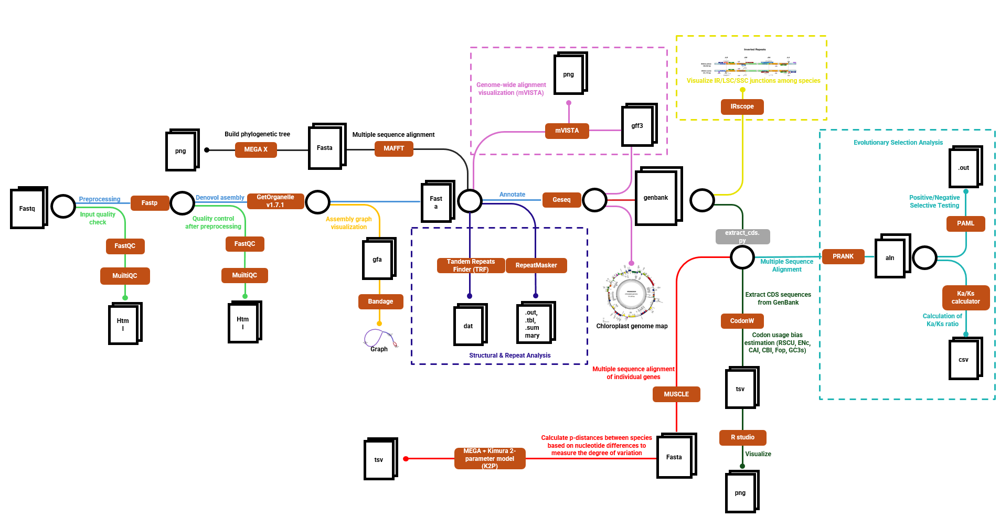

# 🌿 Chloroplast Genomes

  

**Phân tích lục lạp của thực vật**  
Dự án nhằm khảo sát đặc điểm cấu trúc, vùng lặp, phân tích chọn lọc tiến hóa và phát sinh chủng loại dựa trên bộ gen lục lạp hoàn chỉnh.
---

## 📄 Bài báo tham khảo

**Comparative and phylogenetic analyses of eleven complete chloroplast genomes of Dipterocarpoideae**  
🔗 [https://doi.org/10.1186/s13020-021-00538-8](https://doi.org/10.1186/s13020-021-00538-8)

---

## ⚙️ Quy trình phân tích

### 1. Lắp ráp, kiểm tra và chú giải bộ gen *(Assembly & Annotation)*  
**Mục đích:** Xây dựng và hoàn thiện bộ gen lục lạp hoàn chỉnh.  
- **Lắp ráp (assembly):**  
  - Sử dụng công cụ GetOrganelle v1.7.1, một bộ công cụ mã nguồn mở được thiết kế để lắp ráp de novo bộ gen của các bào quan như ty thể (mitochondria) và lục lạp (chloroplast) từ dữ liệu giải trình tự thế hệ mới (NGS).
  - Kết quả sẽ cho ra file fasta là 1 genome hoàng chỉnh và file .gfa để trực quan hóa hình ảnh genome
  - https://github.com/Kinggerm/GetOrganelle
- **Hiệu chỉnh & hoàn thiện (polishing):**  
  - Xử dụng NextPolish để sửa lỗi nhỏ và lấp gap.
  - https://github.com/Nextomics/NextPolish 
- **Chú giải (annotation):**  
  - Sử dụng công cụ trực tuyến Geseq để chú giải bộ genome lục lạp
  - Cho kết quả file Genbank và gff3 để thực hiện các bước phân tích tiếp theo
  - Geseq cho phép trực quan hóa sơ đồ vòng tròn bằng OGDRAW.  
  - https://chlorobox.mpimp-golm.mpg.de/geseq.html
---

### 2. Phân tích cấu trúc & phần tử lặp *(Structural & Repeat Analysis)*  
**Mục đích:** Khảo sát đặc điểm cấu trúc và các yếu tố lặp ảnh hưởng tiến hóa.  
- Tandem Repeats Finder (TRF) → phát hiện lặp trực tiếp.  
- RepeatMasker + auto_repeat.pl → nhận diện TE (LINE, SINE, LTR, transposon).  
- Quan sát vùng IR/LSC/SSC → phát hiện co/giãn IR.  

---

### 3. Phân tích so sánh bộ gen *(Comparative Genomics)*  
**Mục đích:** So sánh độ tương đồng và phát hiện vùng biến đổi nhanh.  
- mVISTA (shuffle-LAGAN) → căn chỉnh toàn bộ genome, hiển thị mức tương đồng.  
- So sánh ranh giới IR bằng Illustrator → trực quan hóa LSC/SSC/IR.  
- CodonW → phân tích độ lệch sử dụng codon (CAI, CBI, Fop, ENc, GC3s, RSCU).  

---

### 4. Phân tích chọn lọc tiến hóa *(Evolutionary Selection Analysis)*  
**Mục đích:** Đánh giá áp lực chọn lọc và phát hiện gen tiến hóa nhanh.  
- Ghép gen đơn bản sao (single-copy).  
- PRANK → căn chỉnh đa trình tự.  
- KaKs Calculator → tính tỷ lệ Ka/Ks.  
- PAML (Codeml) → kiểm định chọn lọc dương (*p* < 0.05).  

---

### 5. Phân tích phát sinh chủng loại *(Phylogenetic Reconstruction)*  
**Mục đích:** Xác định quan hệ tiến hóa giữa các loài.  
- Thu thập thêm các genome bổ sung (bao gồm 3 loài outgroup).  
- Căn chỉnh & ghép các gen đơn bản sao.  
- Dựng cây bằng 3 phương pháp:  
  - MrBayes (Bayesian Inference)  
  - PhyML (Maximum Likelihood)  
  - TreeBeST (Neighbor-Joining)  
- Thực hiện bootstrap 100 lần để xác thực nhánh.  

---

### 6. Phân tích biến động chuỗi và mã vạch DNA *(Sequence Divergence & DNA Barcoding)*  
**Mục đích:** Tìm vùng gen biến động mạnh để định danh loài.  
- MUSCLE → căn chỉnh chuỗi gen.  
- MEGA7 + Kimura 2-parameter model → tính *p-distance*.  
- Chọn gen có *p-distance* cao → ứng viên mã vạch DNA (DNA barcode).  

---

## 🧬 Liên hệ
**Tác giả:** Phan Tấn Phát  
**Đơn vị:** Faculty of Biotechnology, Nong Lam University, Ho Chi Minh City  
📧 Email: [your_email@example.com](mailto:your_email@example.com)
